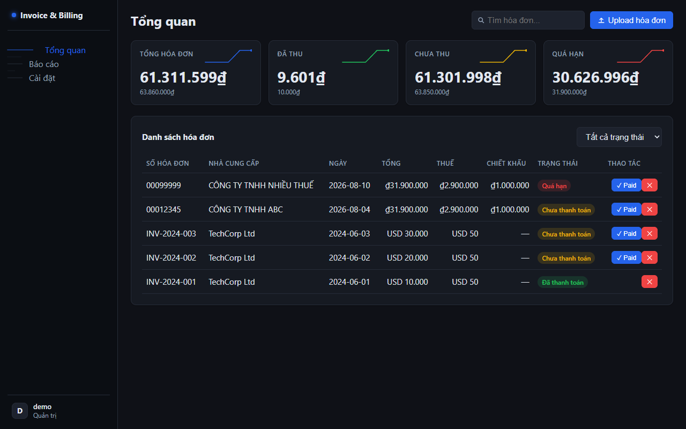
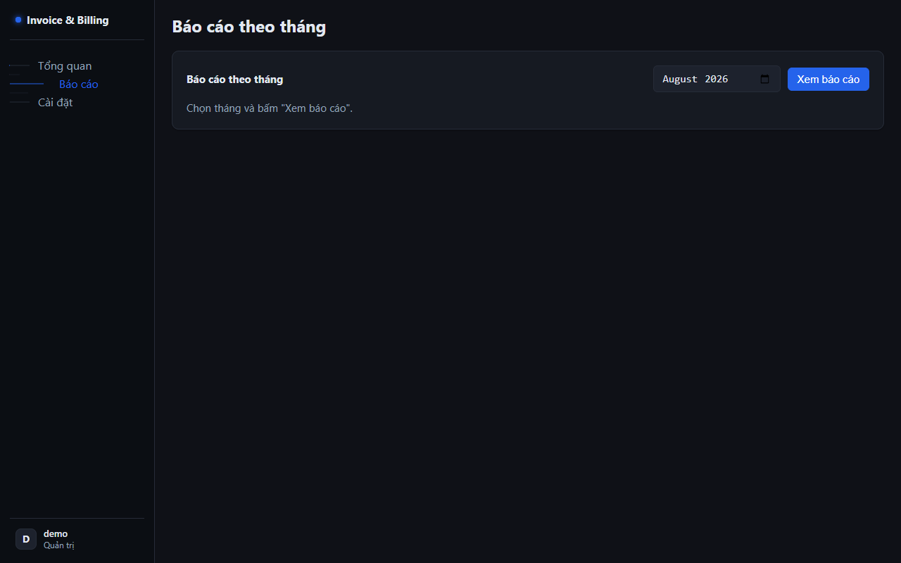
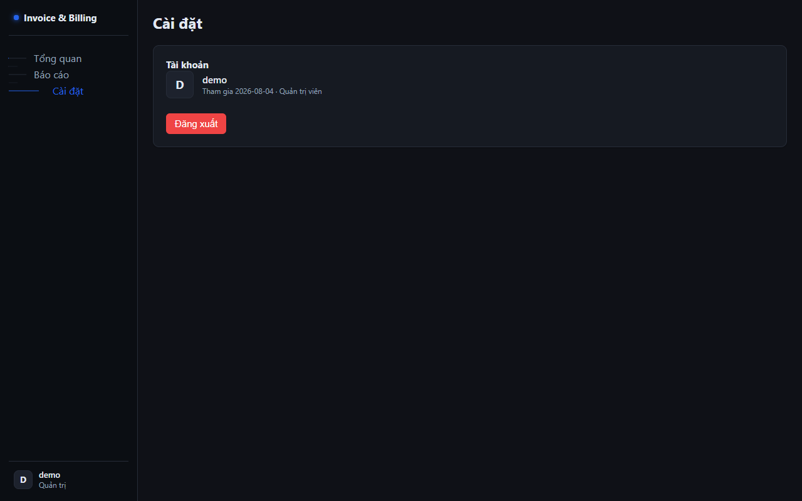

# Invoice & Billing System

> Tự động hóa quản lý hóa đơn: upload → trích xuất → lưu trữ → báo cáo.

## Tính năng

- 📄 **Upload hóa đơn** — PDF, ảnh scan (OCR), hoặc text
- 🇻🇳 **Hóa đơn Việt Nam** — GTGT điện tử (Số hóa đơn, Người bán, Tổng cộng, Thuế GTGT)
- 🌍 **Hóa đơn quốc tế** — tiếng Anh (Invoice No, Vendor, Total, Tax)
- 🔍 **Trích xuất thông minh** — số hóa đơn, nhà cung cấp, ngày, tổng, thuế, chiết khấu, tiền tệ
- 🧮 **Nhiều mức thuế** — cộng dồn 10% + 8%...
- 🏷️ **Chiết khấu** — trích xuất riêng, không nhầm với tổng
- 🤖 **LLM fallback** — regex đọc thiếu (confidence < 0.8) → GPT-4o-mini trích xuất lấp chỗ
- 🔒 **Auth JWT + đa người dùng** — mỗi user chỉ thấy hóa đơn của mình
- 💾 **Lưu trữ SQLite** — persistent, không cần database server
- 📊 **Báo cáo theo tháng** — tổng doanh thu, thuế, đã/chưa thanh toán
- ⚛️ **UI React** — SPA hiện đại, build bằng Vite
- 🎨 **Design system** — tokens tập trung trong `design.md` + `frontend/src/styles.css` (`:root`), dark theme
- 🖼️ **Mockup tham khảo** — `mockup/invoice-dashboard.html` (generate bằng open-design, model qwen3-coder-next)

## Giao diện

| Dashboard | Báo cáo | Cài đặt |
|---|---|---|
|  |  |  |

## Kiến trúc

```
├── frontend/              # React 18 + Vite 5 (login, upload, danh sách, báo cáo)
│   └── src/               # Login.jsx, Invoices.jsx, api.js (Bearer token)
├── src/
│   ├── auth/security.py   # pbkdf2 hash + JWT (PyJWT)
│   ├── llm/base.py        # LLM provider (OpenAI/Mock) cho fallback
│   ├── domain/models.py   # Invoice, User, Token, MonthlyReport
│   ├── extract/extractor.py  # Regex song ngữ + OCR + LLM fallback
│   ├── store/repository.py   # SQLite CRUD + báo cáo tháng (scoped theo user)
│   ├── store/users.py     # UserRepository
│   └── app.py             # /auth/* + /invoices/* (JWT protected)
└── tests/                 # 61 tests (unit + API integration)
```

## Bắt đầu nhanh

```bash
pip install -r requirements.txt
python main.py        # chạy demo end-to-end
python -m uvicorn src.app:app --port 8004
```

LLM fallback (tùy chọn): tạo file `.env` (đã có sẵn key mẫu — thay bằng key của bạn):

```env
LLM_BASE_URL=https://api.qwencoder.cloud/api/v1
LLM_API_KEY=qwk_...
LLM_MODEL=qwen3.7-max
```

Regex đọc đủ (confidence ≥ 0.8) → không gọi LLM. Chỉ thiếu trường → LLM lấp chỗ.
`LLM_MODE=primary`: LLM trích xuất toàn bộ và **ghi đè** vendor/date/total của regex — nhưng mọi giá trị LLM phải qua **grounding validation** (vendor phải khớp 1 dòng trong text, total phải là 1 số có trong text) để chống hallucinate; giá trị không qua được → loại, nhường regex.

Swagger UI: http://localhost:8004/docs

## API

| Method | Endpoint | Mô tả |
|--------|----------|-------|
| POST | `/invoices/upload` | Upload file hóa đơn → trích xuất → lưu |
| POST | `/invoices` | Tạo hóa đơn thủ công |
| GET | `/invoices` | Liệt kê hóa đơn (lọc theo status) |
| GET | `/invoices/{id}` | Lấy hóa đơn theo id |
| PATCH | `/invoices/{id}` | Cập nhật hóa đơn (vd: đánh dấu paid) |
| DELETE | `/invoices/{id}` | Xóa hóa đơn |
| GET | `/reports/monthly/{YYYY-MM}` | Báo cáo theo tháng |

## Tests

```bash
pytest tests/ -v
```

61 tests: trích xuất (Anh + GTGT Việt), OCR, nhiều mức thuế, chiết khấu, CRUD, auth JWT, cách ly đa user, LLM fallback + grounding chống hallucinate, regression trên receipt thật.

## Benchmark — SROIE (dữ liệu thật)

Chạy trên **987 hóa đơn/receipt scan thật** (ICDAR 2019 SROIE: train 626 + test 361, OCR text + ground truth company/date/total, nguồn `jsdnrs/ICDAR2019-SROIE`, dữ liệu trong `data/sroie/`). Đo theo quy trình before/after trên cùng bộ dữ liệu, **không sửa test data**:

| Field | Baseline | Regex gia cố | **+LLM primary** |
|---|---|---|---|
| Vendor (company) | 0.0% | 60.0% | **81.7%** |
| Date | 0.6% | 98.7% | **99.0%** |
| Total | 30.7% | 84.6% | **98.1%** |
| **Overall** | **10.1%** | 80.2% | **92.5%** |

Lần 4 — hybrid regex+LLM (`LLM_MODE=primary`, qwen3.7-max): LLM đọc OCR text, đề xuất vendor/date/total; **grounding validation** loại mọi giá trị không xuất hiện trong text gốc (chống hallucinate — vendor phải (fuzzy-)khớp 1 dòng, total phải là 1 số trong text), regex làm dự phòng. Overall 80.2%→**92.5%** (vendor +212, total +120 receipt đúng thêm). LLM response cache commit trong `tests/data/llm_cache_sroie.jsonl` → chạy lại benchmark không cần API key. Vendor còn sai: LLM đảo cụm từ ("TEA LEAF (M)... THE COFFEE BEAN"), trả chi nhánh thay pháp nhân, hoặc OCR quá hỏng. Cách chạy: `BENCH_LLM=1 LLM_MODE=primary python tests/benchmark_sroie.py` (mặc định không env = regex-only).

Gia cố cho layout receipt thật: `DATE:` / `DATE TIME:`, `TOTAL INCL. GST`, `TOTAL RM/USD`, `TOTAL AFTER ROUNDING`, `NET AMT`, `AMOUNT DUE`/`BALANCE DUE`, công ty dòng đầu không label, ngày 2 chữ số (`20/06/18`), chặn crash khi bắt "." rời rạc. Lần 2 (total 71.9%→**84.6%**, +112 receipt): sửa theo phân tích fail thật — `SUB-TOTAL` gạch nối bị label thành `TOTAL`; `ROUNDING RM 177.20` (total sau GST rounding) được nhận nhưng phải bỏ `ROUNDING ADJUSTMENT`/`ROUNDING 0.00` (chỉ là điều chỉnh); `GST @6% INCLUDED IN TOTAL` không phải total; tiền tệ `MYR`; `TOTAL DUE (GST INC):`. Lần 3 (vendor 55.7%→**60.0%**, +42 receipt): số đăng ký Malaysia (SSM/GST) `(126926-H)`, `(308282-A)` kết thúc bằng CHỮ CÁI — regex strip cũ chỉ nhận kết thúc chữ số → fix `norm_company` strip mọi vị trí + thêm noise line (rounding/feedback/purchase/returnable/duty free...). Số còn sai: vendor chọn nhầm dòng (tên nhân viên/footer), OCR đọc sai tên hãng (DOMINO→DONINO); total nằm trong bảng GST summary không label, GT làm tròn lệch 0.01, OCR đọc hỏng (VD `1007.50`→`1`).

```bash
python tests/benchmark_sroie.py             # chạy lại benchmark (987 receipt)
pytest tests/test_sroie_regression.py       # regression: 12 receipt thật phải giữ nguyên
```

## Benchmark — Hóa đơn Việt Nam thật (MCOCR 2021)

60 hóa đơn tiếng Việt thật từ **MCOCR 2021** (dataset public OCR của AIC, mirror GitHub `TanDuong986/GCN_Vietnamese_invoice`; Co.opmart, VinCommerce, minimart...) có label SELLER/TIMESTAMP/TOTAL_COST + image quality. Pipeline đầy đủ: ảnh → PaddleOCR (vi) → extract (regex hoặc regex+LLM). OCR text được cache sau lần 1 (`data/mcocr_sample/text_cache/`) → rerun deterministic (PaddleOCR CPU vốn nondeterminism ±4% giữa các lần chạy).

| Field | Regex-only | **+LLM primary** |
|---|---|---|
| Vendor | 84.7% | **84.7%** |
| Date | 85.7% | **92.9%** |
| Total | 79.7% | **78.0%** |
| **Overall** | **83.3%** | **85.1%** |

LLM primary (same grounding như SROIE): vendor ngang (regex+dictionary đã tốt), **date +7.2 điểm** (LLM đọc được ngày OCR méo mà regex bỏ sót); total -1.7 điểm — trade-off ghi thẳng: 1 ca LLM bắt nhầm dòng tiền khách trả, trong khi phần fail còn lại là lớp không sửa được (GT annotation sai, GT-vs-OCR bất đồng chữ số). Overall vẫn +1.8. Cache: `tests/data/llm_cache_mcocr.jsonl` — `BENCH_LLM=1 LLM_MODE=primary python tests/benchmark_mcocr.py`.

Phát hiện thật khi chạy trên hóa đơn VN: regex vendor (anchored `from/vendor/người bán`) không áp dụng được cho hóa đơn bán lẻ VN không có label → fallback dòng đầu; so sánh tên công ty phải bỏ hết space + dấu tiếng Việt (OCR hay lệch space/dấu: "MINIMARTANAN" vs "MINIMART ANAN") — nâng vendor 20.3%→49.2%. Lần 2: **từ điển chuỗi bán lẻ VN** (`_VN_CHAINS`: VinCommerce, Minimart, Co.opmart, FamilyMart, The Coffee House...) + fuzzy match (≥0.9) — OCR đọc sai tên hãng được chuẩn hóa về thương hiệu, và brand nằm khác dòng với vendor line (receipt bắt đầu bằng tên chi nhánh "VM+QNH 690 Tran Phu" nhưng "VinCommerce" nằm dòng dưới → quét cả text) — vendor 49.2%→**84.7%**. Giới hạn vendor còn lại (8/59, ghi thẳng): OCR hỏng hoàn toàn brand (cửa hàng nhỏ không trong từ điển, VD "p000'6"), GT tự có lỗi OCR ("MINIMART ANANAN"), brand không xuất hiện trong text OCR. **Soi 12/59 total fail (6 trường hợp):** GT annotation sai (receipt in 236.990 nhưng GT ghi 17), GT từ OCR pipeline khác bất đồng với OCR hiện tại (60.100 vs 60.000, 95.100 vs 95.000), OCR rớt chữ số (222.000→22.000); amount nằm dòng SAU "Tổng cộng" không bắt được (cần layout-aware parse — chưa làm vì OCR nondeterminism ±4% làm khó đo lường). Note: date/total lệch ±4% giữa các lần chạy = nondeterminism của PaddleOCR (CPU), số ghi là lần chạy cuối.

```bash
python tests/benchmark_mcocr.py             # chạy lại benchmark (tự tải 60 ảnh nếu thiếu)
```

## Chạy

```bash
# Backend + UI (đã build sẵn trong dist)
pip install -r requirements.txt
python -m uvicorn src.app:app --port 8004

# Frontend dev (hot reload) — tùy chọn
cd frontend && npm install && npm run dev   # → http://localhost:5173
```

UI: http://localhost:8004 — đăng ký tài khoản → upload hóa đơn → báo cáo.

## OCR (tùy chọn)

Cài để đọc ảnh scan hóa đơn:
```bash
pip install pytesseract paddleocr Pillow
# + cài đặt engine: tesseract-ocr (lang vie) hoặc paddleocr
```
Không cài vẫn chạy — chỉ mất tính năng đọc ảnh.

## Khách hàng mục tiêu

- Kế toán, freelancer, SME cần quản lý hóa đơn đầu vào
- Trả phí hàng tháng (SaaS) cho việc tiết kiệm giờ nhập liệu thủ công
