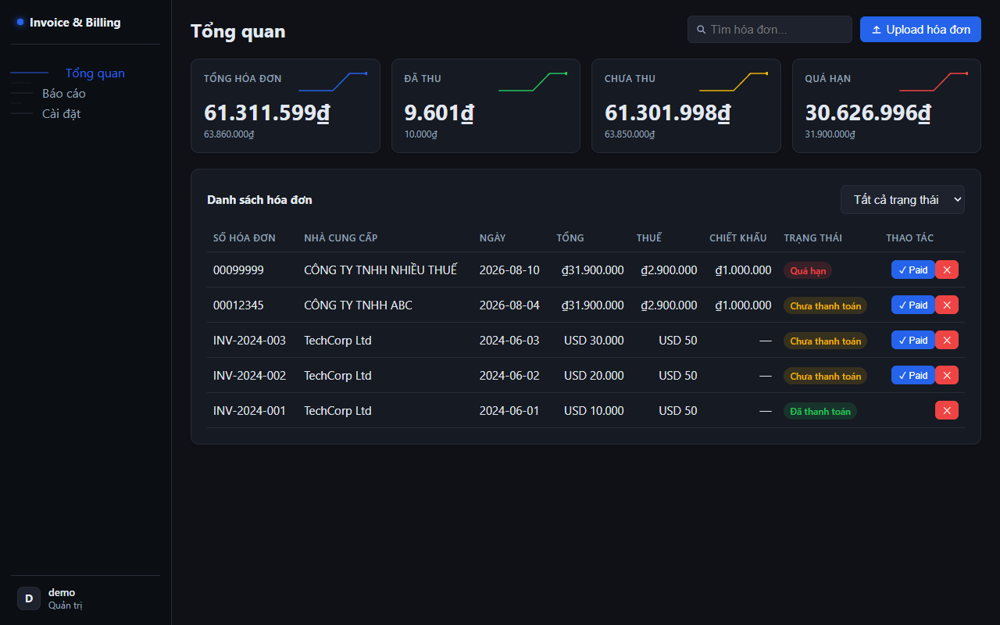
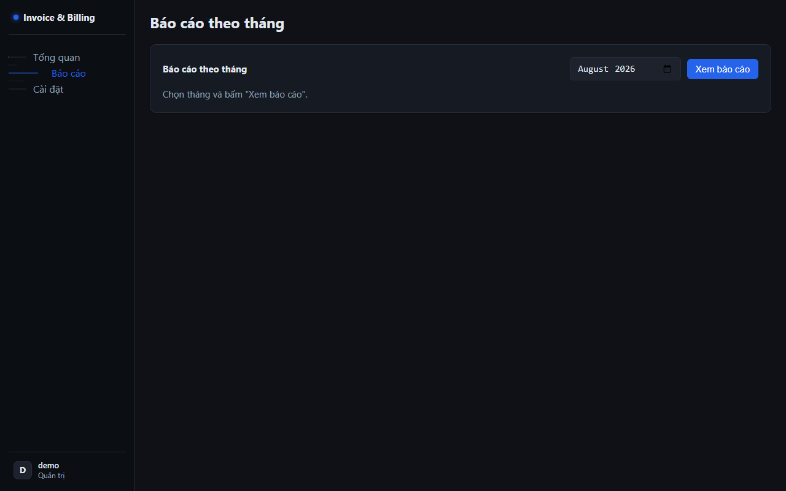
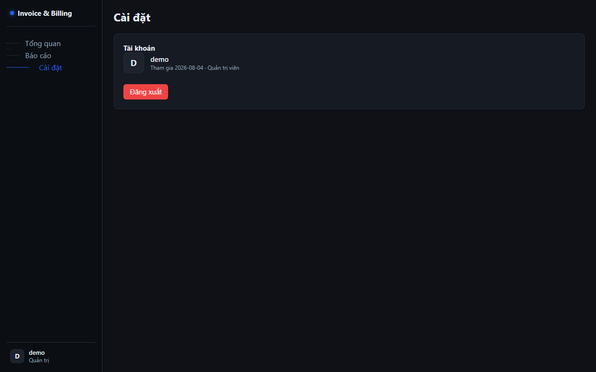

# Invoice & Billing System

> Tự động hóa quản lý hóa đơn: upload → trích xuất → lưu trữ → báo cáo.

## Tính năng

- 📄 **Upload hóa đơn** — PDF, ảnh scan (OCR), hoặc text
- 🇻🇳 **Hóa đơn Việt Nam** — GTGT điện tử (Số hóa đơn, Người bán, Tổng cộng, Thuế GTGT)
- 🌍 **Hóa đơn quốc tế** — tiếng Anh (Invoice No, Vendor, Total, Tax)
- 🔍 **Trích xuất thông minh** — số hóa đơn, nhà cung cấp, ngày, tổng, thuế, chiết khấu, tiền tệ
- 🧾 **QR hóa đơn điện tử VN** — decode QR trong ảnh/PDF (cv2) → đối chiếu total/vendor/MST đã OCR: 2 nguồn khớp → tăng confidence, OCR đọc sai total → giá trị QR (dữ liệu máy sinh) thắng
- 📋 **Line items** — bắt bảng hàng hóa (Mã SP / SL / Đơn giá / Thành tiền, Anh + Việt), lọc rác bằng SL × Đơn giá ≈ Thành tiền → báo cáo chi tiêu theo mặt hàng
- 🧮 **Nhiều mức thuế** — cộng dồn 10% + 8%...
- 🏷️ **Chiết khấu** — trích xuất riêng, không nhầm với tổng
- 🤖 **LLM fallback** — regex đọc thiếu (confidence < 0.7, ngưỡng calibrate từ SROIE) → LLM trích xuất lấp chỗ
- 🔒 **Auth JWT + đa người dùng** — mỗi user chỉ thấy hóa đơn của mình; xác minh email bằng link bấn-một-lần (SMTP, tùy chọn)
- 💾 **Lưu trữ SQLite** — persistent, không cần database server
- 📊 **Báo cáo theo tháng** — tổng doanh thu, thuế, đã/chưa thanh toán
- ⚛️ **UI React** — SPA hiện đại, build bằng Vite
- 🎨 **Design system** — tokens tập trung trong `design.md` + `frontend/src/styles.css` (`:root`), dark theme
- 🔔 **Nhắc chụp hóa đơn** — đẩy text thông báo giao dịch (SMS ngân hàng/MoMo/ZaloPay/email) vào `POST /payments/ingest` → parser đọc số tiền, tự ghép hóa đơn cùng số tiền (đánh dấu PAID); chưa có bill thì hiện card "Giao dịch chờ hóa đơn" trên Dashboard + gửi email nhắc (cấu hình `EMAIL_SMTP_*`). Tùy chọn: `IMAP_*` để poller nền tự đọc email báo giao dịch từ inbox mỗi 60s, tự gán user theo cột `users.email` hoặc `IMAP_USER_MAP`; email lỗi giữ nguyên UNSEEN để chu kỳ sau đọc lại
- 📱 **PWA + push notification** — cài UI lên màn hình chính điện thoại (manifest + service worker), nhận thông báo native trên màn hình khóa khi có giao dịch chờ hóa đơn (Web Push, `VAPID_*`; xem [Thông báo đẩy](#thông-báo-đẩy-trên-điện-thoại-pwa))
- 🖼️ **Mockup tham khảo** — `mockup/invoice-dashboard.html` (generate bằng open-design, model qwen3-coder-next)

## Giao diện

| Dashboard | Báo cáo | Cài đặt |
|---|---|---|
|  |  |  |

## Kiến trúc

```
├── frontend/              # React 18 + Vite 5 (login, upload, danh sách, báo cáo)
│   └── src/               # Login.jsx, Invoices.jsx, api.js (Bearer token)
├── src/
│   ├── auth/security.py   # pbkdf2 hash + JWT (PyJWT)
│   ├── llm/base.py        # LLM provider (OpenAI/Mock) cho fallback
│   ├── domain/models.py   # Invoice, User, Token, MonthlyReport
│   ├── extract/extractor.py  # Regex song ngữ + OCR + LLM fallback
│   ├── store/repository.py   # SQLite CRUD + báo cáo tháng (scoped theo user)
│   ├── store/users.py     # UserRepository
│   └── app.py             # /auth/* + /invoices/* (JWT protected)
└── tests/                 # 61 tests (unit + API integration)
```

## Bắt đầu nhanh

### Chạy backend local

```bash
python3 -m venv .venv
. .venv/bin/activate
pip install -r requirements.txt
cp .env.example .env
python -m uvicorn main:app --reload --port 8000
```

Backend cung cấp `/health`, `/ready` và Swagger tại http://localhost:8000/docs. Đặt `OPEN_REGISTRATION=true` trong `.env` khi cần tạo tài khoản local; production phải đặt `APP_ENV=production`, `JWT_SECRET` riêng và `CORS_ORIGINS` cụ thể.

### Chạy frontend local

```bash
cd frontend
npm ci
npm run dev -- --host 0.0.0.0
```

Mở http://localhost:5173. Frontend dùng `VITE_API_BASE=http://localhost:8000` mặc định.

### Chạy bằng Docker Compose

```bash
cp .env.example .env
# thay JWT_SECRET bằng một secret ngẫu nhiên trước khi chạy production
JWT_SECRET="$(python3 -c 'import secrets; print(secrets.token_urlsafe(32))')" docker compose up --build
```

Compose chạy backend tại http://localhost:8000 và frontend tại http://localhost:5173, đồng thời lưu SQLite/upload data trong volume `invoice-data`.

### Demo end-to-end

```bash
python main.py
```

LLM fallback (tùy chọn): tạo file `.env` (đã có sẵn key mẫu — thay bằng key của bạn):

```env
LLM_BASE_URL=https://api.qwencoder.cloud/api/v1
LLM_API_KEY=qwk_...
LLM_MODEL=qwen3.7-max
```

Regex đọc đủ (confidence ≥ 0.7, ngưỡng calibrate) → không gọi LLM. Chỉ thiếu trường → LLM lấp chỗ.
`LLM_MODE=primary`: LLM trích xuất toàn bộ và **ghi đè** vendor/date/total của regex — nhưng mọi giá trị LLM phải qua **grounding validation** (vendor phải khớp 1 dòng trong text, total phải là 1 số có trong text) để chống hallucinate; giá trị không qua được → loại, nhường regex.

Swagger UI: http://localhost:8004/docs

## API

| Method | Endpoint | Mô tả |
|--------|----------|-------|
| POST | `/invoices/upload` | Upload file hóa đơn → trích xuất → lưu |
| POST | `/invoices` | Tạo hóa đơn thủ công |
| GET | `/invoices` | Liệt kê hóa đơn (lọc theo status) |
| GET | `/invoices/{id}` | Lấy hóa đơn theo id |
| PATCH | `/invoices/{id}` | Cập nhật hóa đơn (vd: đánh dấu paid) |
| DELETE | `/invoices/{id}` | Xóa hóa đơn |
| GET | `/reports/monthly/{YYYY-MM}` | Báo cáo theo tháng |
| POST | `/payments/ingest` | Push text báo giao dịch → parse + tự ghép hóa đơn |
| GET | `/payments/transactions?status=pending_receipt` | Feed "chờ upload hóa đơn" (notification) |
| POST | `/payments/transactions/{id}/dismiss` | Bỏ qua nhắc nhở |
| POST | `/payments/transactions/{id}/match` | Ghép tay với hóa đơn |

```bash
# Ví dụ: đẩy 1 SMS/MoMo/email báo trừ tiền
curl -X POST localhost:8000/payments/ingest \
  -H "Authorization: Bearer $TOKEN" -H "Content-Type: application/json" \
  -d '{"raw_text":"VCB tru 350.000 VND luc 01/10/2026 ND: WINMART","source":"sms"}'
```

## Xác minh tài khoản (email)

Mới đăng ký / reset mật khẩu → gửi email xác nhận (SMTP). Cấu hình `.env`:

```bash
EMAIL_SMTP_HOST=smtp.example.com
EMAIL_SMTP_PORT=587
EMAIL_SMTP_USER=noreply@example.com
EMAIL_SMTP_PASS=change-me
EMAIL_FROM=noreply@example.com
```

User chưa xác nhận email → mọi route trả `403 EMAIL_NOT_VERIFIED`. Sau đăng ký, **công
cụ nền (IMAP poller) hoặc bạn tự gửi lại link** qua `POST /auth/resend-verification`
(JSON `{"username":"..."}`) → email chứa link bấn-một-lần `/auth/verify-email/confirm?token=...`.
Hoặc gọi thẳng `POST /auth/verify-email` với `token` nếu nhận được qua kênh khác.

> Email không bắt buộc — nếu không cấu hình SMTP, register trả về
> `verification_sent: false`; admin có thể verify tay trong DB
> (`UPDATE users SET verified=1 WHERE username='...'`) để demo.

## Thông báo đẩy trên điện thoại (PWA)

UI là PWA: "Thêm vào màn hình chính" là dùng như app, và khi bật thông báo
thì có **push native trên màn hình khóa** mỗi khi có giao dịch chờ chụp hóa đơn
(cùng lúc với email nhắc). Server gửi qua Web Push chuẩn (VAPID).

**1. Sinh VAPID key + điền `.env`:**

```bash
python3 scripts/gen_vapid_keys.py     # in ra 3 dòng, dán vào .env
# VAPID_PUBLIC_KEY=BNVB...
# VAPID_PRIVATE_KEY=./vapid_private.pem   (file PEM, đã gitignore — không commit)
# VAPID_SUBJECT=mailto:ban@example.com
```

Restart backend. Không cấu hình VAPID → app vẫn chạy, chỉ không gửi push được
(nút "Bật thông báo đẩy" sẽ báo lỗi rõ ràng).

**2. Điều kiện bắt buộc — HTTPS:**
Service worker + push chỉ hoạt động trên `https://` hoặc `http://localhost`.
Mở app qua IP LAN kiểu `http://192.168.x.x:5173` sẽ **không** bật được push.
Cách nhanh không cần cấu hình gì thêm: cài [Tailscale](https://tailscale.com)
trên laptop + điện thoại rồi chạy `tailscale serve --bg 5173` (hoặc Caddy/Nginx
nếu deploy VPS) — điện thoại mở URL `https://<máy>.<tailnet>.ts.net`.

**3. Trên điện thoại:**
- **Android (Chrome):** mở URL HTTPS → menu ⋮ → *Thêm vào màn hình chính* →
  mở từ icon → *Cài đặt* → **Bật thông báo đẩy** → cho phép quyền thông báo.
- **iPhone (iOS 16.4+):** bắt buộc *Safari → Chia sẻ → Thêm vào màn hình chính*,
  mở từ icon rồi mới bật được (Safari thường không có Web Push).
- Bấm **Gửi thử** để kiểm tra ngay — nếu thấy thông báo hiện trên màn hình khóa
  là xong. Lúc có giao dịch chưa ghép hóa đơn, server tự đẩy cùng nội dung với
  email nhắc (`[Nhắc] Chụp hóa đơn cho giao dịch 350,000 VND`).

Vận hành: subscription của thiết bị lưu trong bảng `push_subscriptions`;
thiết bị gỡ app / hết hạn (push service trả 404/410) tự bị xoá khỏi DB.

## Tests

```bash
pytest tests/ -v
```

198 tests: trích xuất (Anh + GTGT Việt), OCR, layout-aware total (chọn theo bbox: số dưới "Tổng cộng", phân biệt SUB-TOTAL vs TOTAL), parse số đa locale (comma/dot-thousands chọn quy ước theo ngữ cảnh receipt), chống trùng invoice (upload cùng file → gộp, cùng số hóa đơn → 409), line items (bắt bảng Mã SP/SL/Đơn giá/Thành tiền, SL×Đơn giá≈Thành tiền lọc rác), QR hóa đơn điện tử (decode ảnh/PDF → đối chiếu total/vendor: khớp tăng confidence, OCR sai QR sửa), provenance theo từng field (confidence + source) + UI review tô đỏ field confidence thấp để user sửa nhanh, chỉnh sửa ghi review_history + export `GET /eval/corrections` làm data eval, calibrate ngưỡng gọi LLM bằng script `scripts/calibrate_llm_threshold.py` (`LLM_CALL_THRESHOLD` env, default 0.7 = knee đo trên SROIE 987 receipt thật), batch extract (đúng signature `mime_type`, cách ly lỗi từng file), nhiều mức thuế, chiết khấu, CRUD, auth JWT, cách ly đa user, LLM fallback + grounding chống hallucinate, regression trên receipt thật, payments (parse SMS bank/MoMo + auto-match 2 chiều), IMAP poller + email push + web push (subscribe/unsubscribe, gửi khi pending, dọn subscription 410), PDF scan fallback OCR.

## Phạm vi milestone Phase 0+1

Milestone này hoàn thiện nền tảng dùng được: xác thực JWT, upload và trích xuất hóa đơn, SQLite CRUD theo user, provenance/job status, báo cáo JSON/PDF, health/readiness, cấu hình production fail-fast, Docker Compose, CI và frontend có loading/error/empty/success, tìm kiếm, lọc, phân trang, báo cáo và cài đặt.

## Phạm vi nâng cao (Phase 2 + Phase 4) — đã triển khai

- **Phase 2 — Đa tenant (organizations/workspaces + RBAC):** mỗi user có thể tạo organization, mời thành với theo role `owner/admin/member/viewer`, kiểm soát truy cập chặt chẽ (xem `src/domain/orgs.py`, `src/store/orgs.py`, `src/routers/orgs.py`).
- **Phase 4 — RAG search + eval:** tìm kiếm vector offline bằng TF-IDF + cosine trên hóa đơn, không phụ thuộc ML bên ngoài, kèm script đánh giá `scripts/eval_rag.py` (xem `src/search/`, `tests/test_rag_search.py`).
- **Phase 4 — Observability + K8s:** endpoint `/metrics` theo chuẩn Prometheus (fallback stdlib nếu chưa cài `prometheus_client`), manifest Kubernetes (namespace, configmap, secret template, deployment, service, ingress, HPA, ServiceMonitor) và dashboard Grafana (xem `src/observability/`, `k8s/`, `monitoring/`).

## Còn lại cho vòng tiếp theo

Phase 3 (Stripe/Paddle checkout, subscriptions, webhooks, entitlements) và một số mục Phase 4 chưa triển khai: refresh-token/revocation, email verification, password reset, MFA, rate limiting, malware scanning, object storage hardening, backup/restore, privacy/DPA/SLA và mở rộng accessibility/settings.

## Benchmark — SROIE (dữ liệu thật)

Chạy trên **987 hóa đơn/receipt scan thật** (ICDAR 2019 SROIE: train 626 + test 361, OCR text + ground truth company/date/total, nguồn `jsdnrs/ICDAR2019-SROIE`, dữ liệu trong `data/sroie/`). Đo theo quy trình before/after trên cùng bộ dữ liệu, **không sửa test data**. Dataset phát hành theo **CC-BY-4.0** — dữ liệu thuộc về tác giả gốc (https://huggingface.co/datasets/jsdnrs/ICDAR2019-SROIE), repo này chỉ tái phân phối kèm attribution:

| Field | Baseline | Regex gia cố | **+LLM primary** |
|---|---|---|---|
| Vendor (company) | 0.0% | 60.0% | **81.7%** |
| Date | 0.6% | **95.4%** | **99.0%** |
| Total | 30.7% | 84.6% | **98.1%** |
| **Overall** | **10.1%** | **80.6%** | **92.5%** |

**Đính chính số đo (calibrate theo GT):** trước đây benchmark so `issue_date` với GT thô —
GT in kiểu `02 APR 2018`, `11.02.18`, `20180428` mà `_normalize_date` không chuẩn hóa được → 84 receipt
extractor đọc ĐÚNG vẫn bị tính là fail (date 86.8% → thật ra **95.4%**). Đã sửa `_normalize_date` nhận
thêm 3 dạng trên. Bảng dưới là số cũ trước đính chính (giữ để so lịch sử).

**Regex-only hiện tại (sau đính chính + fix guard total):** vendor 59.8% / date 95.4% /
**total 82.1%** / overall **79.0%** (2861 field-GT). Lần 5 — guard `qty` của `_pick_total` soi cả 40 ký tự
trước nên loại oan dòng `TOTAL : 31.00` nằm ngay dưới header bảng (`DESCRIPTION QTY PRICE AMOUNT`) —
thu hẹp về CÙNG DÒNG với nhãn; thêm `point` vào bad-words (`TOTAL POINTS` = điểm tích lũy ≠ tiền).
Đo trên 987 receipt: total 715→**728** (+13, 80.6%→82.1%), 18 ca sửa / 5 ca "mới fail" trong đó 3 ca là
GT lệch 1 cent so với số in trên bill (60.30 vs 60.31) và 2 ca vốn đã fail với giá trị sai khác — **không
có hồi quy thật**. Fixture khoá hành vi: `tests/data/sroie_regression/` (16 receipt).

Lần 4 — hybrid regex+LLM (`LLM_MODE=primary`, qwen3.7-max): LLM đọc OCR text, đề xuất vendor/date/total; **grounding validation** loại mọi giá trị không xuất hiện trong text gốc (chống hallucinate — vendor phải (fuzzy-)khớp 1 dòng, total phải là 1 số trong text), regex làm dự phòng. Overall 80.2%→**92.5%** (vendor +212, total +120 receipt đúng thêm). LLM response cache commit trong `tests/data/llm_cache_sroie.jsonl` → chạy lại benchmark không cần API key. Vendor còn sai: LLM đảo cụm từ ("TEA LEAF (M)... THE COFFEE BEAN"), trả chi nhánh thay pháp nhân, hoặc OCR quá hỏng. Cách chạy: `BENCH_LLM=1 LLM_MODE=primary python tests/benchmark_sroie.py` (mặc định không env = regex-only).

Gia cố cho layout receipt thật: `DATE:` / `DATE TIME:`, `TOTAL INCL. GST`, `TOTAL RM/USD`, `TOTAL AFTER ROUNDING`, `NET AMT`, `AMOUNT DUE`/`BALANCE DUE`, công ty dòng đầu không label, ngày 2 chữ số (`20/06/18`), chặn crash khi bắt "." rời rạc. Lần 2 (total 71.9%→**84.6%**, +112 receipt): sửa theo phân tích fail thật — `SUB-TOTAL` gạch nối bị label thành `TOTAL`; `ROUNDING RM 177.20` (total sau GST rounding) được nhận nhưng phải bỏ `ROUNDING ADJUSTMENT`/`ROUNDING 0.00` (chỉ là điều chỉnh); `GST @6% INCLUDED IN TOTAL` không phải total; tiền tệ `MYR`; `TOTAL DUE (GST INC):`. Lần 3 (vendor 55.7%→**60.0%**, +42 receipt): số đăng ký Malaysia (SSM/GST) `(126926-H)`, `(308282-A)` kết thúc bằng CHỮ CÁI — regex strip cũ chỉ nhận kết thúc chữ số → fix `norm_company` strip mọi vị trí + thêm noise line (rounding/feedback/purchase/returnable/duty free...). Số còn sai: vendor chọn nhầm dòng (tên nhân viên/footer), OCR đọc sai tên hãng (DOMINO→DONINO); total nằm trong bảng GST summary không label, GT làm tròn lệch 0.01, OCR đọc hỏng (VD `1007.50`→`1`).

```bash
python tests/benchmark_sroie.py             # chạy lại benchmark (987 receipt)
pytest tests/test_sroie_regression.py       # regression: 16 receipt thật phải giữ nguyên
```

## Review & calibration (data eval từ người dùng)

- **UI review**: mỗi hóa đơn có provenance theo field (`confidence`, `source`). Field dưới
  `CONF_WARN = 0.7` (hoặc máy không trích được) hiện **ô đỏ**; bấm "Xem" → sửa inline → Lưu.
  Hàng có field cần kiểm tra được đánh dấu chấm đỏ ở cột mã hóa đơn.
- **Audit + eval**: mỗi lần sửa ghi `review_history` (field, giá trị cũ/mới, confidence + source
  lúc máy đọc, ai sửa, lúc nào) và đổi provenance field đó thành `manual` (confidence 1.0).
  Xuất làm data eval: `GET /eval/corrections` — `old_value` là máy đọc, `new_value` là người sửa
  (coi như ground truth) → đo được ngưỡng confidence nào là đáng ngờ.
- **Calibrate ngưỡng gọi LLM**: `python scripts/calibrate_llm_threshold.py` chạy offline trên
  987 receipt SROIE có GT, in bảng đánh đổi chi phí/recall theo từng ngưỡng và chọn knee.
  Số đo hiện tại (regex, chưa LLM): 47.7% receipt sai ≥1 field — lỗi tập trung ở vendor
  đọc theo dòng đầu (38.7% sai) và total theo nhãn (15.9% sai; 21 receipt không tìm thấy total).
  Knee = 0.7: gọi LLM 12.0%, bắt 22.5% ca lỗi, precision 89.8%. Ngưỡng 0.9 đòi 6.6× chi phí (79.0%)
  cho +64.8 điểm recall nhưng precision rơi còn 52.7% → **không đáng**. Giới hạn đã biết: điểm confidence
  hiện tại là `min(1, số field/5)` nên 365/471 ca lỗi nằm ngoài tầm với của LLM ở knee — muốn bắt thêm
  phải nâng chất lượng trích xuất vendor/total (hoặc thêm đặc trưng route vào điểm confidence).

## Benchmark — Hóa đơn Việt Nam thật (MCOCR 2021)

60 hóa đơn tiếng Việt thật từ **MCOCR 2021** (dataset public OCR của AIC, mirror GitHub `TanDuong986/GCN_Vietnamese_invoice`; Co.opmart, VinCommerce, minimart...) có label SELLER/TIMESTAMP/TOTAL_COST + image quality. Pipeline đầy đủ: ảnh → PaddleOCR (vi) → extract (regex hoặc regex+LLM). OCR text được cache sau lần 1 (`data/mcocr_sample/text_cache/`) → rerun deterministic (PaddleOCR CPU vốn nondeterminism ±4% giữa các lần chạy).

| Field | Regex-only | **+LLM primary** |
|---|---|---|
| Vendor | 84.7% | **84.7%** |
| Date | 85.7% | **92.9%** |
| Total | 79.7% | **78.0%** |
| **Overall** | **83.3%** | **85.1%** |

LLM primary (same grounding như SROIE): vendor ngang (regex+dictionary đã tốt), **date +7.2 điểm** (LLM đọc được ngày OCR méo mà regex bỏ sót); total -1.7 điểm — trade-off ghi thẳng: 1 ca LLM bắt nhầm dòng tiền khách trả, trong khi phần fail còn lại là lớp không sửa được (GT annotation sai, GT-vs-OCR bất đồng chữ số). Overall vẫn +1.8. Cache: `tests/data/llm_cache_mcocr.jsonl` — `BENCH_LLM=1 LLM_MODE=primary python tests/benchmark_mcocr.py`.

Phát hiện thật khi chạy trên hóa đơn VN: regex vendor (anchored `from/vendor/người bán`) không áp dụng được cho hóa đơn bán lẻ VN không có label → fallback dòng đầu; so sánh tên công ty phải bỏ hết space + dấu tiếng Việt (OCR hay lệch space/dấu: "MINIMARTANAN" vs "MINIMART ANAN") — nâng vendor 20.3%→49.2%. Lần 2: **từ điển chuỗi bán lẻ VN** (`_VN_CHAINS`: VinCommerce, Minimart, Co.opmart, FamilyMart, The Coffee House...) + fuzzy match (≥0.9) — OCR đọc sai tên hãng được chuẩn hóa về thương hiệu, và brand nằm khác dòng với vendor line (receipt bắt đầu bằng tên chi nhánh "VM+QNH 690 Tran Phu" nhưng "VinCommerce" nằm dòng dưới → quét cả text) — vendor 49.2%→**84.7%**. Giới hạn vendor còn lại (8/59, ghi thẳng): OCR hỏng hoàn toàn brand (cửa hàng nhỏ không trong từ điển, VD "p000'6"), GT tự có lỗi OCR ("MINIMART ANANAN"), brand không xuất hiện trong text OCR. **Soi 12/59 total fail (6 trường hợp):** GT annotation sai (receipt in 236.990 nhưng GT ghi 17), GT từ OCR pipeline khác bất đồng với OCR hiện tại (60.100 vs 60.000, 95.100 vs 95.000), OCR rớt chữ số (222.000→22.000); amount nằm dòng SAU "Tổng cộng" không bắt được → đã làm layout-aware parse (dùng bbox từ OCR, test trong test_invoice.py); đo lại MCOCR chưa chạy vì OCR nondeterminism ±4% làm khó đo lường. Note: date/total lệch ±4% giữa các lần chạy = nondeterminism của PaddleOCR (CPU), số ghi là lần chạy cuối.

```bash
python tests/benchmark_mcocr.py             # chạy lại benchmark (tự tải 60 ảnh nếu thiếu)
```

## Benchmark — Receipt quốc tế (CORD v2, CC-BY-4.0)

60 receipt scan thật từ **CORD v2** (HuggingFace `naver-clova-ix/cord-v2`, 800 receipt train — dataset của NAVER Clova AI, license **CC-BY-4.0**, xem https://huggingface.co/datasets/naver-clova-ix/cord-v2; dữ liệu thuộc về tác giả gốc). Pipeline: ảnh → PaddleOCR (vi) → regex extract (không LLM). OCR text cache `data/cord_sample/text_cache/` → rerun deterministic.

**Giới hạn GT CORD (ghi thẳng):** annotation chỉ có `menu` + `sub_total` + `total` — KHÔNG có vendor/company và KHÔNG có date → benchmark đo duy nhất field `total`. Thêm nữa, receipt CORD là dạng Hàn/Anh khác hẳn GTGT VN — đây là test **generalization** của extractor, không phải tập tối ưu.

| Field | Regex-only | **+LLM primary** |
|---|---|---|
| Total | 41.8% | **90.9%** |

**Phát hiện thật khi soi fail (2 vòng):** (1) GT CORD v2 KHÔNG nhất quán quy ước số — comma-thousands `"1,591,600"` (40/57), dot-thousands kiểu Hàn `"61.500"` = 61.500 won (13/57), tiền tệ `"Rp 16.500"`, hỗn hợp EU `"62.000,00"`; norm_total (vốn cho SROIE/MCOCR) coi chấm là thập phân → parse sai 1000× cho 13 row. Sửa parser GT riêng cho CORD (`gt_total` trong `benchmark_cord.py`, ghi chú đầy đủ) → số tái tính: regex-only **giảm** 63.0%→**41.8%** (lần đầu GT sai "tình cờ" làm vài row trượt). (2) Chính regex extractor cũng parse số theo locale nhầm: OCR text in `"61.500"` → regex ra 61.5 thay vì 61.500 (dot=thập phân) — **điểm yếu thật của regex trên receipt quốc tế** → **đã sửa** bằng parser số đa locale (`_to_float` + `_detect_comma_decimal` bỏ phiếu quy ước trên toàn receipt: token `"61.500"` với dấu chấm nhóm-3 trong ngữ cảnh dot-thousands → 61.500; 4 test trong `test_invoice.py`; SROIE giữ nguyên 80.6% total — fail giống hệt trước sửa). Số 41.8% trong bảng là trước khi sửa parser; rerun `benchmark_cord.py` cần `pip install datasets` + cache OCR (`data/cord_sample/`) nên chưa đo lại.

**LLM primary (+49.1 điểm):** LLM đọc tổng tiền theo ngữ cảnh tiền tệ của receipt (không phụ thuộc quy ước dấu), grounding chống hallucinate như SROIE/MCOCR. 50/55 đúng. 5 fail còn lại (ghi thẳng): OCR lệch chữ số (258.500 vs 256.500), LLM nhầm dòng tiền khách trả, GT vs OCR bất đồng. Cache `tests/data/llm_cache_cord.jsonl` → rerun không tốn API key.

```bash
pip install datasets                # benchmark-only dep (không cần cho app)
python tests/benchmark_cord.py      # regex-only
BENCH_LLM=1 LLM_MODE=primary python tests/benchmark_cord.py   # +LLM (cache sẵn, không cần key)
```

## Chạy

```bash
# Backend + UI (đã build sẵn trong dist)
pip install -r requirements.txt
python -m uvicorn src.app:app --port 8004

# Frontend dev (hot reload) — tùy chọn
cd frontend && npm install && npm run dev   # → http://localhost:5173
```

UI: http://localhost:8004 — đăng ký tài khoản → upload hóa đơn → báo cáo.

## OCR (tùy chọn)

Cài để đọc ảnh scan hóa đơn:
```bash
pip install pytesseract paddleocr Pillow
# + cài đặt engine: tesseract-ocr (lang vie) hoặc paddleocr
```
Không cài vẫn chạy — chỉ mất tính năng đọc ảnh.

## Khách hàng mục tiêu

- Kế toán, freelancer, SME cần quản lý hóa đơn đầu vào
- Trả phí hàng tháng (SaaS) cho việc tiết kiệm giờ nhập liệu thủ công
